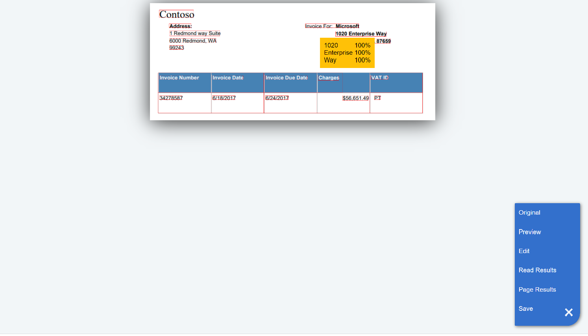

### HTML5 Azure Form Recognizer Layout API Results Formatter

View an interactive demo [here](https://davideker.github.io/layout/).



This **HTML5** utility formats the **JSON** results of the [**Azure Form Recognizer Layout API**]("https://docs.microsoft.com/en-us/azure/cognitive-services/form-recognizer/quickstarts/python-layout") to make the results more comprehensible. Features include toggling read and page layout layers and tooltips that display the predictions and confidence level of each highlighted element. New features include inline editing documents, document previews and saving edits. 

To format the results of an API call, manually or programatically, replace the original and blank image source with a link to your document and a blank document respectively...

```html

**will not**</ins> work. To run a simple HTTP server locally use:
```javascript
npx http-server
```